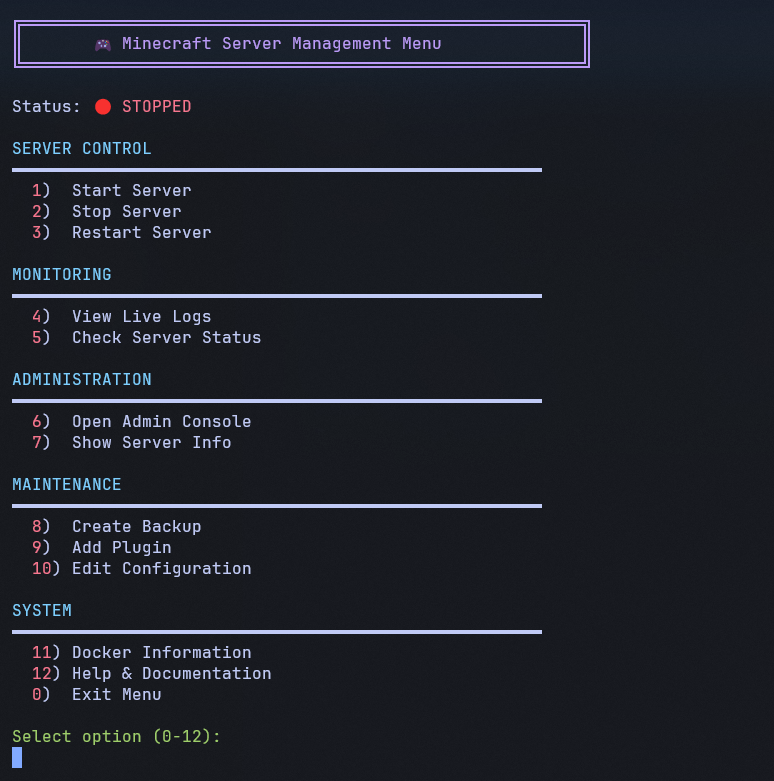
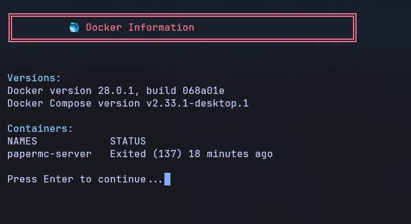

# 🎮 Minecraft Server Setup Guide
## PaperMC with Docker & playit.gg Tunneling

A complete, production-ready guide to host a Minecraft Java Edition server using Docker and PaperMC, with automatic public tunneling via playit.gg.

---

## 📋 Table of Contents
1. [Overview](#overview)
2. [SnapShots](#snapshots)
3. [Architecture](#architecture)
4. [Prerequisites](#prerequisites)
5. [Installation](#installation)
6. [File Structure & Explanation](#file-structure--explanation)
7. [Quick Start](#quick-start)
7. [Script Usage Guide](#script-usage-guide)
8. [Configuration](#configuration)
9. [Troubleshooting](#troubleshooting)
10. [Advanced Topics](#advanced-topics)

---

## 🎯 Overview

This project provides a **complete, easy-to-manage Minecraft Java Edition server** setup using:

- **Docker** - Containerized server for easy deployment and management
- **PaperMC** - High-performance Minecraft server software
- **playit.gg** - Public tunneling (no port forwarding needed)
- **Bash Scripts** - Automated server management (start, stop, backup, etc.)

**Benefits:**
- ✅ Works on Linux, Windows (WSL2), and macOS
- ✅ No port forwarding or router configuration needed
- ✅ Easy plugin installation
- ✅ Automated backups
- ✅ Simple command-line management
- ✅ Admin console for server commands

---
## Snapshots
### Menu

### Docker Information

### Documentation

---
## 🏗️ Architecture

```
Your Friends (Different Networks)
            ↓
     playit.gg Tunnel
      (Public URL)
            ↓
    Docker Container
     (PaperMC Server)
            ↓
    World Data & Plugins
```

**Flow:**
1. Friends connect to: `something.playit.gg:12345` (provided by playit.gg)
2. Tunnel routes traffic to your machine at `localhost:25565`
3. Docker container runs PaperMC server
4. All world data stored in `data/` folder (persistent across restarts)

---

## ✅ Prerequisites

### **Supported Operating Systems**
- **Linux (Ubuntu 20.04+, Debian 11+)** ✅ **[RECOMMENDED]**
- **Windows 10/11** (with Docker Desktop + WSL2)
- **macOS** (with Docker Desktop)

### **System Requirements**
| Component | Minimum | Recommended |
|-----------|---------|-------------|
| RAM | 2GB | 4GB+ |
| Storage | 10GB | 20GB+ |
| Internet | 5 Mbps | 10+ Mbps upload |
| CPU | 1 Core | 2+ Cores |

### **Software Requirements**
- Docker & Docker Compose
- Git (optional, for cloning repo)
- Minecraft Java Edition (for testing)
- Text editor (nano, vim, VSCode, etc.)

### **Accounts Required**
- Free playit.gg account (https://playit.gg)

---

## 💻 Installation

### **Step 1: Install Docker**

#### **For Ubuntu/Debian (Recommended)**

```bash
# Update system
sudo apt update && sudo apt upgrade -y

# Install dependencies
sudo apt install -y ca-certificates curl gnupg lsb-release

# Add Docker GPG key
sudo mkdir -p /etc/apt/keyrings
curl -fsSL https://download.docker.com/linux/ubuntu/gpg | \
  sudo gpg --dearmor -o /etc/apt/keyrings/docker.gpg

# Add Docker repository
echo \
  "deb [arch=$(dpkg --print-architecture) signed-by=/etc/apt/keyrings/docker.gpg] \
  https://download.docker.com/linux/ubuntu $(lsb_release -cs) stable" | \
  sudo tee /etc/apt/sources.list.d/docker.sources > /dev/null

# Install Docker
sudo apt update
sudo apt install -y docker-ce docker-ce-cli containerd.io docker-buildx-plugin docker-compose-plugin

# Add user to docker group (run without sudo)
sudo usermod -aG docker $USER
newgrp docker

# Verify installation
docker run hello-world
```

#### **For Windows (Docker Desktop)**

1. Download and install [Docker Desktop for Windows](https://docs.docker.com/desktop/install/windows-install/)
2. Enable WSL2 in Docker Desktop settings
3. Install Ubuntu via WSL: `wsl --install -d Ubuntu`
4. Run all commands in Ubuntu WSL terminal

#### **For macOS**

1. Download and install [Docker Desktop for Mac](https://docs.docker.com/desktop/install/mac-install/)
2. Start Docker Desktop application
3. Verify: `docker --version`

### **Step 2: Create Project Directory**

```bash
# Create directory
mkdir -p ~/minecraft-server
cd ~/minecraft-server

# Create subdirectories
mkdir -p data plugins scripts tools backups logs

# Verify structure
ls -la
```

### **Step 3: Download/Create All Files**

You'll need to create the following files in your `minecraft-server` directory:
- `docker-compose.yml` - Docker configuration
- `.env` - Environment variables
- `scripts/setup.sh` - Setup script
- `scripts/start.sh` - Start script
- `scripts/stop.sh` - Stop script
- `scripts/restart.sh` - Restart script
- `scripts/status.sh` - Status check script
- `scripts/logs.sh` - Logs viewer script
- `scripts/backup.sh` - Backup script
- `scripts/add-plugin.sh` - Plugin installer script
- `scripts/console.sh` - Admin console script
- `scripts/menu.sh` - Interactive menu script

(See below for content of each file)

### **Step 4: Make Scripts Executable**

```bash
chmod +x scripts/*.sh
```

### **Step 5: Run Setup**

```bash
./scripts/setup.sh
```

---

## 📁 File Structure & Explanation

### **Project Directory Layout**

```
minecraft-server/
│
├── docker-compose.yml          # Docker configuration file
├── .env                        # Environment variables (server settings)
├── .gitignore                  # Git ignore file (optional)
│
├── scripts/                    # All management scripts
│   ├── setup.sh               # Initial setup script
│   ├── start.sh               # Start server
│   ├── stop.sh                # Stop server
│   ├── restart.sh             # Restart server
│   ├── status.sh              # Show status
│   ├── logs.sh                # View live logs
│   ├── backup.sh              # Create world backup
│   ├── add-plugin.sh          # Add plugins
│   ├── console.sh             # Admin console
│   └── menu.sh                # Interactive menu
│
├── data/                       # Server data (persistent)
│   ├── world/                 # Main world
│   ├── world_nether/          # Nether dimension
│   ├── world_the_end/         # End dimension
│   ├── plugins/               # Plugins directory
│   ├── server.properties      # Server configuration
│   ├── bukkit.yml             # Bukkit config
│   ├── paper-global.yml       # PaperMC config
│   └── ops.json              # Operators list
│
├── backups/                    # World backups (auto-generated)
│   └── backup_YYYYMMDD_HHMMSS.tar.gz
│
├── tools/                      # Tools directory
│   └── playit                  # playit.gg agent (download)
│
└── README.md                   # This file
```

### **File Descriptions**

#### **docker-compose.yml**
- **Purpose**: Defines the Docker container configuration
- **Contains**: Container name, ports, environment variables, volumes
- **When to edit**: Change server properties like memory, game mode, difficulty
- **Location**: Root directory

#### **.env**
- **Purpose**: Environment variables for the server
- **Contains**: Server memory, difficulty, max players, MOTD
- **When to edit**: Customize server settings without touching docker-compose.yml
- **Location**: Root directory

#### **scripts/setup.sh**
- **Purpose**: Initial setup - creates directories and config files
- **What it does**: Creates docker-compose.yml, .env, directories if they don't exist
- **Run once**: Yes, at the beginning
- **Usage**: `./scripts/setup.sh`

#### **scripts/start.sh**
- **Purpose**: Start the Minecraft server
- **What it does**: Creates/starts Docker container, PaperMC begins loading
- **Run when**: You want to turn on the server
- **Usage**: `./scripts/start.sh`

#### **scripts/stop.sh**
- **Purpose**: Gracefully stop the server
- **What it does**: Sends stop command to server, saves world, stops container
- **Run when**: You want to shut down the server safely
- **Usage**: `./scripts/stop.sh`

#### **scripts/restart.sh**
- **Purpose**: Restart the server
- **What it does**: Calls stop.sh then start.sh
- **Run when**: You need to reload plugins or apply changes
- **Usage**: `./scripts/restart.sh`

#### **scripts/status.sh**
- **Purpose**: Check if server is running and show resource usage
- **What it does**: Shows container status, CPU/memory usage, port bindings
- **Run when**: You want to check server health
- **Usage**: `./scripts/status.sh`

#### **scripts/logs.sh**
- **Purpose**: View live server logs (real-time)
- **What it does**: Streams Docker logs continuously
- **Run when**: Debugging issues or watching startup
- **Usage**: `./scripts/logs.sh` (Press Ctrl+C to exit)

#### **scripts/backup.sh**
- **Purpose**: Create a backup of your world
- **What it does**: Saves world files to `backups/` folder, keeps last 10 backups
- **Run when**: Before major updates or regularly
- **Usage**: `./scripts/backup.sh`

#### **scripts/add-plugin.sh**
- **Purpose**: Install a Minecraft plugin
- **What it does**: Copies .jar file to plugins folder, restarts server
- **Run when**: You want to add a new plugin
- **Usage**: `./scripts/add-plugin.sh /path/to/plugin.jar` or `./scripts/add-plugin.sh https://download.url/plugin.jar`

#### **scripts/console.sh**
- **Purpose**: Interactive admin console for server commands
- **What it does**: Allows you to execute commands (say, give, op, etc.) interactively
- **Run when**: You need to run commands on the server
- **Usage**: `./scripts/console.sh`
- **Example commands**: 
  - `say Server restarting in 10 seconds`
  - `op PlayerName`
  - `give @a diamond`

#### **scripts/menu.sh**
- **Purpose**: Interactive menu system
- **What it does**: Shows a menu with options (start, stop, backup, etc.)
- **Run when**: You prefer a GUI-like experience
- **Usage**: `./scripts/menu.sh`

---

## 🚀 Quick Start

```bash
# 1. Clone or navigate to project
cd ~/minecraft-server

# 2. Make scripts executable
chmod +x scripts/*.sh

# 3. Run initial setup
./scripts/setup.sh

# 4. Start the server
./scripts/start.sh

# 5. Watch it startup (takes 30-60 seconds)
./scripts/logs.sh

# 6. Once startup complete, test locally
# - Open Minecraft Java Edition
# - Multiplayer → Direct Connect
# - Address: localhost
# - Join!

# 7. Setup playit.gg for public access (see below)
```

---

## 🕹️ Script Usage Guide

### **Typical Usage Scenarios**

#### **Scenario 1: Starting Server for the First Time**

```bash
cd ~/minecraft-server
./scripts/setup.sh      # Setup (run once)
./scripts/start.sh      # Start server
./scripts/logs.sh       # Watch logs until "Done! For help, type 'help'"
# Ctrl+C to exit logs
```

#### **Scenario 2: Daily Use**

```bash
# Morning - start server
./scripts/start.sh

# During day - check status
./scripts/status.sh

# If needed - run console commands
./scripts/console.sh
# Type: say Good morning players!
# Type: exit

# Evening - stop server
./scripts/stop.sh
```

#### **Scenario 3: Adding a Plugin**

```bash
# Download plugin or have file ready

# Option A: Local file
./scripts/add-plugin.sh ~/Downloads/EssentialsX.jar

# Option B: From URL
./scripts/add-plugin.sh https://github.com/example/plugin.jar

# Server automatically restarts
./scripts/logs.sh       # Watch plugin load
```

#### **Scenario 4: Regular Maintenance**

```bash
# Create backup (daily/weekly)
./scripts/backup.sh

# Update and restart
./scripts/restart.sh

# Check health
./scripts/status.sh

# View recent activity
./scripts/logs.sh
```

#### **Scenario 5: Emergency Stop**

```bash
# Graceful stop (saves world)
./scripts/stop.sh

# Or force kill if frozen
docker kill papermc-server
docker rm papermc-server
```

### **Command Reference**

| Task | Command |
|------|---------|
| Start Server | `./scripts/start.sh` |
| Stop Server | `./scripts/stop.sh` |
| Restart Server | `./scripts/restart.sh` |
| Check Status | `./scripts/status.sh` |
| View Logs | `./scripts/logs.sh` |
| Create Backup | `./scripts/backup.sh` |
| Open Console | `./scripts/console.sh` |
| Add Plugin | `./scripts/add-plugin.sh <file>` |
| Menu (Interactive) | `./scripts/menu.sh` |
| Setup (First Time) | `./scripts/setup.sh` |

---

## ⚙️ Configuration

### **.env File Explanation**

```bash
# Memory allocation - increase if server lags
# 2G = 2GB RAM, 4G = 4GB RAM, etc.
SERVER_MEMORY=2G

# Server name shown in Minecraft
SERVER_NAME="My Minecraft Server"

# Difficulty: 0=Peaceful, 1=Easy, 2=Normal, 3=Hard
DIFFICULTY=1

# Maximum number of players
MAX_PLAYERS=20

# Game mode: 0=Survival, 1=Creative, 2=Adventure, 3=Spectator
GAMEMODE=0

# Enable/disable PvP
PVP=true

# Allow players to fly (Creative/Adventure only)
ALLOW_FLIGHT=false

# Spawn protection radius (blocks around spawn)
SPAWN_PROTECTION=16

# Whitelist only specific players
WHITELIST_ENABLED=false

# How far players can see
VIEW_DISTANCE=10

# Entity loading distance
SIMULATION_DISTANCE=10

# Logging level: INFO, DEBUG, WARNING
LOG_LEVEL=INFO
```

### **docker-compose.yml Explanation**

```yaml
version: '3.8'                    # Docker Compose version

services:
  papermc:                        # Service name
    image: itzg/minecraft-server:latest  # Docker image (auto-updates)
    container_name: papermc-server       # Container name
    
    ports:
      - "25565:25565"            # Port binding: host:container
    
    environment:
      EULA: "TRUE"               # Accept Minecraft EULA
      TYPE: "PAPER"              # Server type (PaperMC)
      VERSION: "LATEST"          # Auto-update to latest version
      MEMORY: "2G"               # RAM allocation
      NOGUI: "true"              # No GUI (headless mode)
      
    volumes:
      - ./data:/data             # Mount data folder for persistence
    
    restart: unless-stopped      # Auto-restart on crash
    
    networks:
      - minecraft-net            # Docker network

networks:
  minecraft-net:
    driver: bridge
```

### **Common Configuration Changes**

#### **Increase Server Memory**
```bash
# Edit .env
SERVER_MEMORY=4G

# Restart
./scripts/restart.sh
```

#### **Change Difficulty**
```bash
# Edit .env
DIFFICULTY=2  # Normal mode

# Restart
./scripts/restart.sh
```

#### **Enable Whitelist**
```bash
# Edit .env
WHITELIST_ENABLED=true

# Use console to add players
./scripts/console.sh
# Type: whitelist add PlayerName
```

#### **Change MOTD (Message of the Day)**
```bash
# Use console
./scripts/console.sh
# Type: motd §6Welcome to My Server §c(Updated!)
```

---

## 🔧 Setting Up playit.gg (Public Access)

### **Why playit.gg?**
- ✅ No port forwarding needed
- ✅ No public IP exposure
- ✅ Works from any network (home, office, mobile)
- ✅ Free

### **Step 1: Create Account**
1. Visit https://playit.gg
2. Sign up (free account)
3. Verify email

### **Step 2: Download Agent**
1. Go to https://playit.gg/download
2. Choose your OS:
   - **Linux**: Download `.tar.gz`
   - **Windows**: Download `.exe`
   - **macOS**: Download `.tar.gz`

### **Step 3: Install Agent**

#### **Linux/macOS:**
```bash
# Navigate to tools folder
cd ~/minecraft-server/tools

# Download (replace version number)
wget https://downloads.playit.gg/playit-linux

# Make executable
chmod +x playit-linux

# Run
./playit-linux
```

#### **Windows:**
1. Move downloaded `.exe` to `tools/` folder
2. Double-click `playit.exe`
3. Browser window opens automatically

### **Step 4: Login & Create Tunnel**

1. Click login link in playit.gg window
2. Complete login in browser
3. Agent auto-connects

In playit.gg dashboard:
1. Click "Create Tunnel"
2. Select "Minecraft Java"
3. Local IP: `127.0.0.1`
4. Local Port: `25565`
5. Click "Create"
6. Note your public address: `something.playit.gg:12345`

### **Step 5: Share with Friends**

Send them: `something.playit.gg:12345`

They join by:
- Minecraft → Multiplayer → Direct Connect
- Address: `something.playit.gg:12345`

---

## 🔍 Troubleshooting

### **Problem: Server won't start**

```bash
# Check logs
./scripts/logs.sh

# Common causes:
# - Port 25565 already in use
# - Docker not running
# - Corrupted config files

# Solution 1: Check if port is available
netstat -tlnp | grep 25565
# If in use, stop other programs

# Solution 2: Restart Docker
sudo systemctl restart docker

# Solution 3: Remove and restart
docker compose down
docker compose up -d
./scripts/logs.sh
```

### **Problem: Can't join from localhost**

```bash
# Verify server is running
./scripts/status.sh

# Check port binding
docker port papermc-server

# Verify Minecraft version matches server version
# Check firewall isn't blocking port 25565

# Try joining again (may take 30 seconds to startup)
```

### **Problem: Friends can't connect via playit.gg**

```bash
# Check if playit agent is running
ps aux | grep playit

# Restart playit
# Kill current: Ctrl+C
# Restart: ./playit-linux (or .exe on Windows)

# Verify tunnel in playit.gg dashboard
# Check local address: 127.0.0.1:25565

# Ask friend to use full address with port: something.playit.gg:12345
```

### **Problem: Server very slow/laggy**

```bash
# Check resource usage
./scripts/status.sh
# Look at CPU % and memory

# Solution 1: Increase memory
# Edit .env, change SERVER_MEMORY=4G
# Run: ./scripts/restart.sh

# Solution 2: Reduce view distance
./scripts/console.sh
# Type: gamerule simulationDistance 8

# Solution 3: Reduce max players
# Edit .env, change MAX_PLAYERS=10
```

### **Problem: World corrupted**

```bash
# Stop server
./scripts/stop.sh

# Restore from backup
ls backups/    # List backups
# Choose latest: backup_20240115_120000.tar.gz

# Extract
tar -xzf backups/backup_20240115_120000.tar.gz -C data/

# Restart
./scripts/start.sh
./scripts/logs.sh
```

### **Problem: Out of storage space**

```bash
# Check disk usage
df -h

# Clean old backups
ls -lh backups/
# Manually delete old backup files

# If world is huge:
# Consider moving to larger drive
# Backup world before moving
```

---

## 📚 Advanced Topics

### **1. Automated Daily Backups**

```bash
# Edit crontab
crontab -e

# Add this line for 3 AM daily backup:
0 3 * * * cd ~/minecraft-server && ./scripts/backup.sh

# Save (Ctrl+X, then Y, then Enter for nano)

# Verify
crontab -l
```

### **2. Installing Popular Plugins**

#### **EssentialsX** (Essential commands)
```bash
# Download
wget https://essentials.freedomop.ml/Essentials-2.20.1.jar -O EssentialsX.jar

# Install
./scripts/add-plugin.sh EssentialsX.jar

# Watch logs for "EssentialsX loaded"
```

#### **WorldEdit** (Build tool)
```bash
wget https://dev.bukkit.org/projects/worldedit/download -O WorldEdit.jar
./scripts/add-plugin.sh WorldEdit.jar
```

#### **LiteBans** (Moderation)
```bash
wget https://dev.bukkit.org/projects/litebans/download -O LiteBans.jar
./scripts/add-plugin.sh LiteBans.jar
```

### **3. RCON Commands (Console)**

```bash
./scripts/console.sh

# Useful commands:
say Welcome to the server!              # Broadcast message
op PlayerName                           # Make admin
whitelist add PlayerName                # Whitelist player
give @a diamond 64                      # Give items
teleport @s 0 64 0                      # Teleport to spawn
weather clear                           # Clear weather
time set noon                           # Set time
gamemode creative @s                    # Change gamemode
difficulty hard                         # Change difficulty
save-all                                # Manual save
stop                                    # Graceful shutdown
```

### **4. Performance Tuning**

Edit `data/paper-global.yml`:

```bash
docker exec -it papermc-server nano /data/paper-global.yml
```

Key settings:
```yaml
chunk-loading:
  min-chunk-load-threads: 2
  max-chunk-load-threads: 8
```

### **5. Multiple Worlds**

Edit `data/bukkit.yml` to enable multiple worlds:

```yaml
worlds:
  world:
    Nether:
      enabled: true
    TheEnd:
      enabled: true
  world_creative:
    Nether:
      enabled: false
    TheEnd:
      enabled: false
```

### **6. Custom Server Icon**

Place a 64x64 PNG file at: `data/server-icon.png`

Restart server:
```bash
./scripts/restart.sh
```

### **7. Whitelist Configuration**

```bash
# Open console
./scripts/console.sh

# Add players
whitelist add PlayerName1
whitelist add PlayerName2
whitelist add PlayerName3

# Turn on whitelist
whitelist on

# View whitelist
whitelist list

# Remove player
whitelist remove PlayerName
```

### **8. Operator (Admin) Management**

```bash
./scripts/console.sh

# Make someone an operator
op PlayerName

# Remove operator
deop PlayerName

# List operators
op list
```

---

## 📊 Monitoring & Maintenance

### **Weekly Checklist**
- [ ] Check `./scripts/status.sh` for health
- [ ] Create backup with `./scripts/backup.sh`
- [ ] Review logs for errors: `./scripts/logs.sh`
- [ ] Update plugins if available

### **Monthly Checklist**
- [ ] Update Docker image: `docker pull itzg/minecraft-server`
- [ ] Restart server to apply updates: `./scripts/restart.sh`
- [ ] Clean old backups (keep last 10)
- [ ] Check disk space: `df -h`

### **Useful Docker Commands**

```bash
# View container info
docker ps -a

# View resource usage
docker stats papermc-server

# Remove old images
docker image prune -a

# View volume info
docker volume ls

# Manual backup of data
docker cp papermc-server:/data ./data-backup-$(date +%s)
```

---

## 🔐 Security Best Practices

1. **Whitelist Players**
   ```bash
   ./scripts/console.sh
   whitelist on
   whitelist add PlayerName
   ```

2. **Change RCON Password**
   ```bash
   # Edit data/server.properties
   # Find: rcon.password=
   # Change to strong password
   ```

3. **Regular Backups**
   ```bash
   ./scripts/backup.sh  # Run weekly minimum
   ```

4. **Keep Software Updated**
   ```bash
   docker pull itzg/minecraft-server:latest
   ./scripts/restart.sh
   ```

5. **Monitor Access**
   ```bash
   ./scripts/logs.sh
   # Look for suspicious activity
   ```

---

## 📞 Getting Help

### **Resources**
- **PaperMC Docs**: https://docs.papermc.io/
- **Docker Docs**: https://docs.docker.com/
- **playit.gg Help**: https://playit.gg/support
- **Spigot Forums**: https://www.spigotmc.org/forums/
- **r/admincraft**: https://reddit.com/r/admincraft

### **Common Issues**

| Issue | Link |
|-------|------|
| Connection Problems | PaperMC Troubleshooting |
| Performance | Paper Optimization Guide |
| Plugin Errors | Check plugin documentation |
| Docker Issues | Docker Troubleshooting |

---

## 📝 File Checklist

Before starting, ensure you have:
- ✅ `docker-compose.yml` - Docker config
- ✅ `.env` - Server settings
- ✅ `scripts/setup.sh` - Setup script
- ✅ `scripts/start.sh` - Start script
- ✅ `scripts/stop.sh` - Stop script
- ✅ `scripts/restart.sh` - Restart script
- ✅ `scripts/status.sh` - Status script
- ✅ `scripts/logs.sh` - Logs script
- ✅ `scripts/backup.sh` - Backup script
- ✅ `scripts/add-plugin.sh` - Plugin script
- ✅ `scripts/console.sh` - Console script
- ✅ `scripts/menu.sh` - Menu script

---

## 🎉 You're Ready!

```bash
cd ~/minecraft-server
./scripts/setup.sh
./scripts/start.sh
./scripts/logs.sh

# Wait for "Done! For help, type 'help'"
# Then join localhost in Minecraft!
```

---

**Version**: 1.0 | **Last Updated**: January 2025 | **Status**: Production Ready ✅